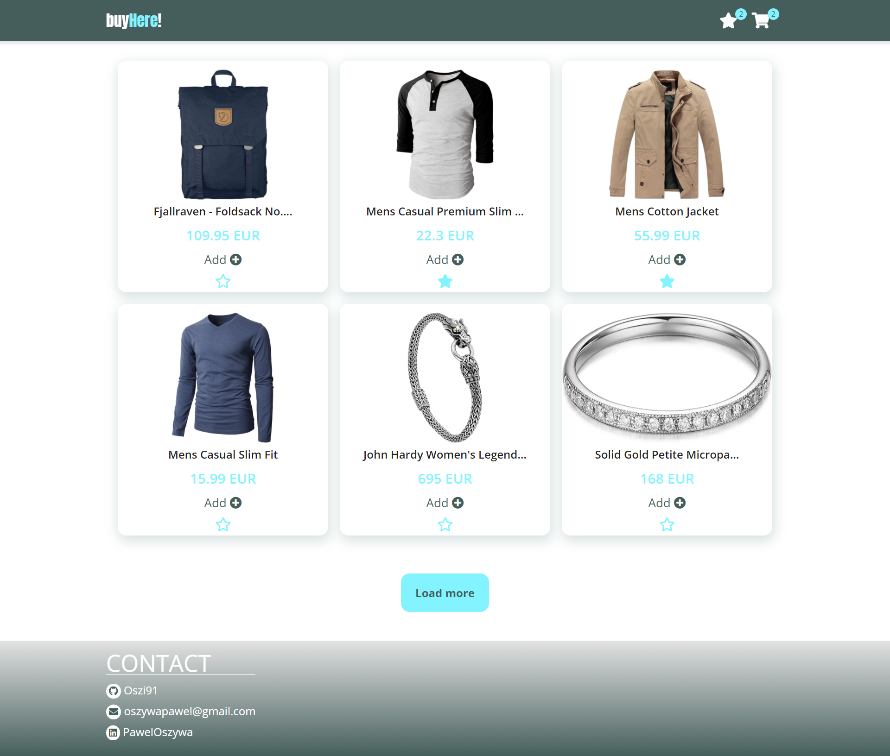
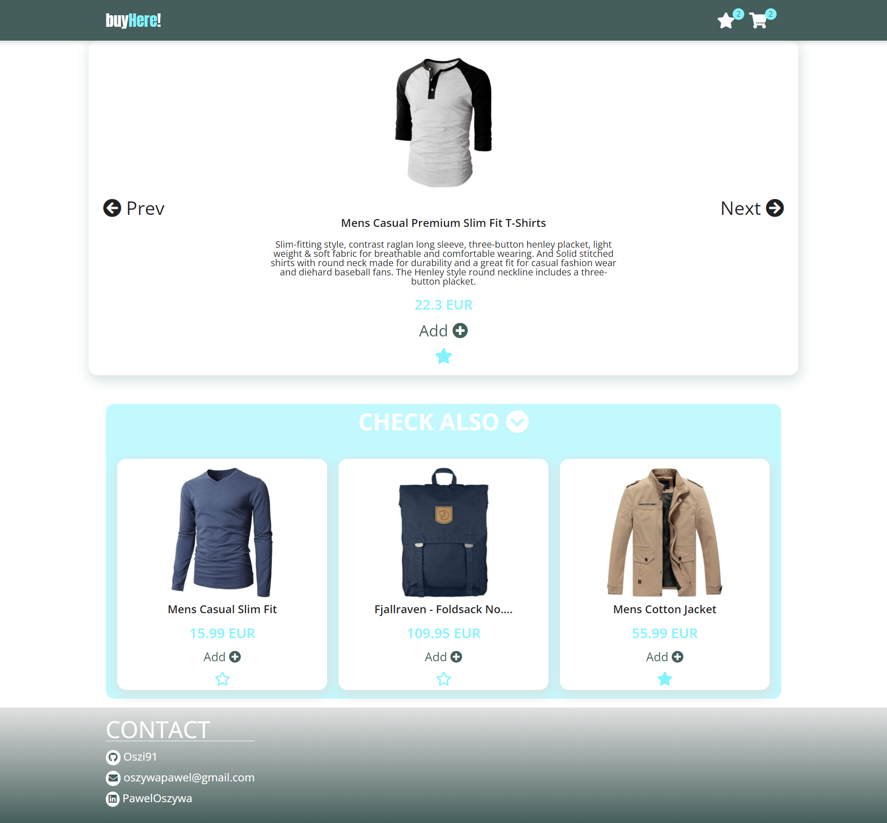
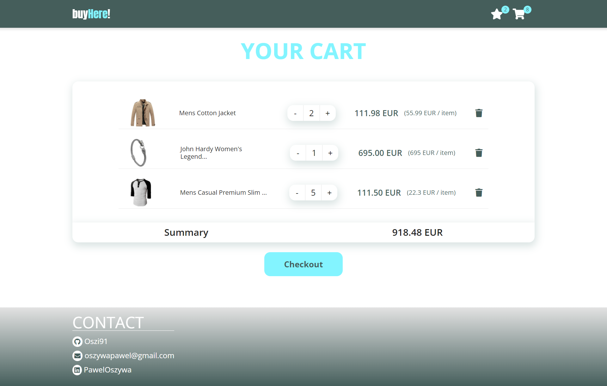
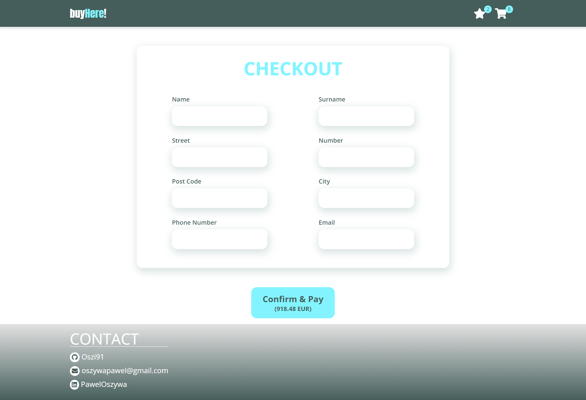
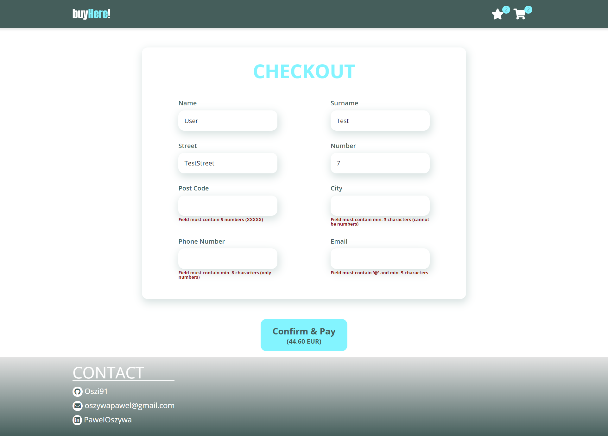
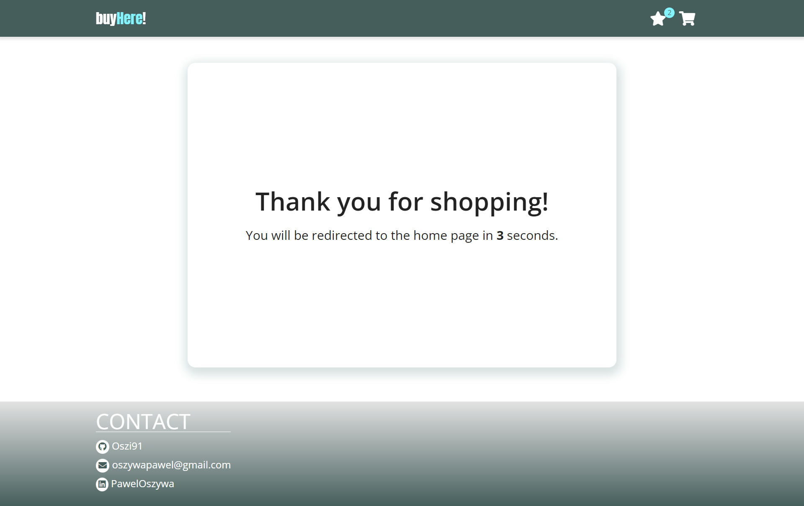

# buy-here - Live Demo
[buy-here - Live Demo](https://oszi91.github.io/buy-here)

## Description:
Find a product that interests you and add it to your shopping cart or favorites. All the data is collected locally, if you refresh the page it will remain unchanged. In the shopping cart you will find a summary of your order and you can also edit it. Once you have made a decision, fill in the form with your data correctly and enjoy your shopping.
All data comes from [FakeStoreApi](https://fakestoreapi.com/).

## buy-here - Preview







## Technologies:
| Tool | Description |
| :-------------:|--------------|
| HTML5 | A markup language used for structuring, and presenting content on the World Wide Web. |
| SASS | 	A preprocessor scripting language that is interpreted or compiled into CSS. |
| React | JavaScript library for creating user interfaces. |
| React Router Dom | DOM bindings for React Router. |
| React Redux | React Redux is the official React UI bindings layer for Redux. It lets your React components read data from a Redux store, and dispatch actions to the store to update state. |
| Redux Toolkit | The Redux Toolkit package is intended to be the standard way to write Redux logic. |
| Redux Persist | Redux Persist is a library which let add persistence to the store. The library will automatically save the store each time the state updates. |

## Installation:

-  ```git clone https://github.com/oszi91/buy-here``` to clone the repository.
-  npm install to install all dependencies
-  npm start and http://localhost:3000/ in the browser to preview the app
